# 🌟 क्रेता-बन्धु (Customer Support Agent)
### Next-Generation AI Voice Assistant with Native Audio Streaming

    

A revolutionary customer support AI agent featuring **Gemini 2.5 Flash** for intelligence, **Murf Falcon TTS** for ultra-realistic voice synthesis, real-time voice interruption, intelligent product discovery, and a stunning copper-cyan visual theme with OGL-powered WebGL effects.

---

## 🎯 Key Features

### 🗣️ **Natural Voice Conversations**
- **Murf Falcon TTS**: Ultra-realistic, human-like voice synthesis with natural intonation and emotion
- **Gemini Native Audio**: Direct audio-to-audio processing for understanding user speech
- **Immediate Barge-In**: Interrupt the agent anytime - it stops instantly (local voice activity detection)
- **Ultra-Low Latency**: <100ms response time using Web Audio API and AudioWorklet
- **Natural Flow**: Maintains context across multiple turns like a real conversation

### 🛍️ **Smart Product Discovery**
- **52+ Products** across 4 main categories with 14 subcategories
- **Multi-criteria Search**: Filter by name, category, subcategory, or brand
- **Browse Mode**: Explore categories and subcategories interactively
- **Zero Hallucination**: Agent only mentions products that actually exist in the database

### 🎨 **Stunning Visual Experience**
- **OGL-Powered Voice Orb**: Real-time WebGL orb with solar flares and copper/cyan color scheme
- **Dynamic Light Rays**: Animated background rays emanating from orb position
- **Hyperspace Loader**: Cinematic warp-speed loading screen with brand colors
- **Custom Cursor**: Interactive cursor with particle trails
- **Glassmorphic UI**: Modern blur effects with copper (#c87d4a) and cyan (#00d9ff) accents

### 🤖 **Intelligent Agent Capabilities**
- **13 Built-in Tools**: Order management, product search, refunds, customer profiles, and more
- **Autonomous Decision Making**: Knows when to call APIs vs. provide direct answers
- **Context-Aware**: Remembers customer preferences, addresses, and order history
- **Multi-Language**: Supports English and Hindi (brand: क्रेता-बन्धु)

### 🔧 **Developer-Friendly**
- **TypeScript**: Full type safety across the stack
- **Modular Architecture**: Clean separation of concerns
- **Easy Customization**: Well-documented code with clear component structure
- **SQLite Database**: Zero-config database that just works

---

## 🏗️ System Architecture

```mermaid
flowchart TB
    subgraph User["👤 User Interaction"]
        Voice[🎤 Voice Input]
        Visual[👁️ Visual Feedback]
    end

    subgraph Frontend["⚛️ React Frontend (Port 5173)"]
        Orb[🌟 VoicePoweredOrb<br/>WebGL + Solar Flares]
        AudioIn[🎧 AudioWorklet<br/>Voice Activity Detection]
        AudioOut[🔊 Web Audio API<br/>PCM Playback]
        UI[🎨 UI Components<br/>Glassmorphic Design]
        Tools[🛠️ Tool Executor<br/>API Caller]
    end

    subgraph AI["🧠 AI Services"]
        Gemini[Gemini 2.5 Flash<br/>Speech Understanding & Intelligence]
        Murf[Murf Falcon TTS<br/>Voice Synthesis]
        VAD[Local VAD<br/>Barge-In Detection]
    end

    subgraph Backend["🗄️ Node.js Backend (Port 3005)"]
        API[📡 REST API<br/>14 Endpoints]
        DB[(SQLite Database<br/>Categories, Products, Orders)]
    end

    Voice -->|Raw Audio| AudioIn
    AudioIn -->|PCM 16kHz| Gemini
    AudioIn -->|RMS Analysis| VAD
    
    VAD -.->|Interrupt Signal| AudioOut
    
    Gemini -->|Tool Calls| Tools
    Gemini -->|Text Response| Murf
    Murf -->|High-Quality Audio| AudioOut
    
    Tools <-->|HTTP REST| API
    API <-->|SQL Queries| DB
    Tools -->|Results| Gemini
    
    AudioOut -->|Speaker| Visual
    Gemini -->|Transcription| UI
    Orb -.->|Visual Feedback| Visual

    style Gemini fill:#4285f4,color:#fff
    style VAD fill:#00d9ff,color:#000
    style Orb fill:#c87d4a,color:#fff
    style DB fill:#339933,color:#fff
```



---

## 📂 Project Structure

```
Customer Support Agent/
├── 📁 Lumina Support/          # Frontend Application
│   ├── 📁 src/
│   │   ├── 📁 components/      # Reusable UI Components
│   │   │   ├── ChatMessageBubble.tsx
│   │   │   └── Header.tsx
│   │   ├── 📁 components/ui/   # WebGL & Visual Effects
│   │   │   ├── VoicePoweredOrb.tsx      # Main voice orb (OGL)
│   │   │   ├── LightRays.tsx            # Background light rays
│   │   │   ├── HyperspaceLoader.tsx     # Loading screen
│   │   │   ├── CustomCursor.tsx         # Interactive cursor
│   │   │   ├── BlurFade.tsx             # Blur animations
│   │   │   ├── DottedSurface.tsx        # Dotted background
│   │   │   ├── GlowingEffect.tsx        # Glow effects
│   │   │   └── HolographicCard.tsx      # Card components
│   │   ├── 📁 pages/
│   │   │   ├── AgentInterface.tsx       # Main voice agent UI
│   │   │   └── LandingPage.tsx          # Home page
│   │   ├── 📁 services/
│   │   │   ├── audioUtils.ts            # Audio processing utilities
│   │   │   └── murfService.ts           # Murf AI integration (legacy)
│   │   ├── 📁 utils/
│   │   │   └── cn.ts                    # Tailwind class merger
│   │   ├── App.tsx                      # Root component
│   │   ├── index.tsx                    # Entry point
│   │   └── index.css                    # Global styles
│   ├── index.html
│   ├── package.json
│   ├── tsconfig.json
│   ├── vite.config.ts
│   └── postcss.config.js
│
├── 📁 server/                   # Backend API Server
│   ├── databaseServer.js        # Express server + SQLite
│   ├── lumina.db               # SQLite database file
│   ├── check_db.js             # Database inspection utility
│   ├── test_api.js             # API testing script
│   ├── package.json
│   ├── DATABASE_UPDATE_SUMMARY.md
│   └── .env
│
├── 📁 Design Prompts/          # Design documentation
├── LLM_INTEGRATION_SUMMARY.md  # AI integration guide
├── QUICK_START.md              # Quick start guide
└── README.md                   # This file
```

---

## 🗄️ Database Schema

### **Categories Table**
```sql
CREATE TABLE categories (
    id INTEGER PRIMARY KEY AUTOINCREMENT,
    name TEXT NOT NULL UNIQUE,
    description TEXT
);
```

**Data (4 categories):**
1. Electronics & Gadgets - Latest technology and electronic devices
2. Home & Kitchen - Everything for your home and kitchen needs
3. Sports & Outdoors - Fitness and outdoor adventure gear
4. Automotive - Car and bike accessories and tools

---

### **Subcategories Table**
```sql
CREATE TABLE subcategories (
    id INTEGER PRIMARY KEY AUTOINCREMENT,
    name TEXT NOT NULL,
    category_id INTEGER NOT NULL,
    FOREIGN KEY (category_id) REFERENCES categories(id)
);
```

**Data (14 subcategories):**
- **Electronics & Gadgets:** Mobiles & Accessories, Laptops/PCs/Components, Smart Home Devices, Wearables
- **Home & Kitchen:** Furniture, Kitchen Tools, Décor, Appliances
- **Sports & Outdoors:** Fitness Gear, Sportswear, Outdoor Essentials
- **Automotive:** Car Accessories, Bike Accessories, Tools & Maintenance

---

### **Products Table**
```sql
CREATE TABLE products (
    id INTEGER PRIMARY KEY AUTOINCREMENT,
    name TEXT NOT NULL,
    price INTEGER NOT NULL,
    stock INTEGER NOT NULL,
    description TEXT,
    category_id INTEGER,
    subcategory_id INTEGER,
    brand TEXT,
    image_url TEXT,
    FOREIGN KEY (category_id) REFERENCES categories(id),
    FOREIGN KEY (subcategory_id) REFERENCES subcategories(id)
);
```

**Example Products:**
- iPhone 15 Pro (Apple) - ₹119,900 - Electronics > Mobiles
- MacBook Air M3 (Apple) - ₹99,900 - Electronics > Laptops
- Air Fryer 4L (Philips) - ₹6,999 - Home & Kitchen > Appliances
- Running Shoes (Nike) - ₹4,999 - Sports > Sportswear
- Car Dashboard Camera - ₹4,999 - Automotive > Car Accessories

**Total: 52 products across all categories**

---

### **Orders Table**
```sql
CREATE TABLE orders (
    id TEXT PRIMARY KEY,
    customer_name TEXT,
    product_name TEXT,
    quantity INTEGER,
    status TEXT,
    delivery_date TEXT,
    order_date TEXT,
    delivery_slot TEXT,
    discount_code TEXT
);
```

---

### **Customers Table**
```sql
CREATE TABLE customers (
    id INTEGER PRIMARY KEY AUTOINCREMENT,
    name TEXT,
    email TEXT UNIQUE,
    phone TEXT,
    address TEXT,
    loyalty_points INTEGER DEFAULT 0,
    last_order_id TEXT
);
```

---

### **Refunds & Feedback Tables**
```sql
CREATE TABLE refunds (
    id INTEGER PRIMARY KEY AUTOINCREMENT,
    order_id TEXT,
    status TEXT,
    amount INTEGER,
    reason TEXT
);

CREATE TABLE feedback (
    id INTEGER PRIMARY KEY AUTOINCREMENT,
    customer_id INTEGER,
    rating INTEGER,
    comment TEXT,
    email TEXT
);
```

---

## 🛠️ Agent Tools & Capabilities

The AI agent has access to 13 powerful tools for handling customer requests:

### 📦 **Product & Inventory Tools**

| Tool | Description | Parameters | Example Use |
|------|-------------|------------|-------------|
| `check_stock` | Search products by name, category, subcategory, or brand. Returns price, stock, description. | `product_name`, `category`, `brand` (all optional) | "Do you have Apple products?"<br/>"Show me fitness gear" |
| `browse_categories` | List all 4 main product categories | None | "What do you sell?" |
| `browse_subcategories` | List subcategories (optionally filtered by category) | `category` (optional) | "What electronics do you have?" |

### 🛒 **Order Management Tools**

| Tool | Description | Parameters | Example Use |
|------|-------------|------------|-------------|
| `search_order` | Get order status and details | `order_id` | "Track order ORD-12345" |
| `place_order` | Create a new order | `item_name`, `quantity`, `address`, `customer_name` | "I want to buy an iPhone" |
| `cancel_order` | Cancel a processing order | `order_id` | "Cancel my order" |
| `update_shipping_address` | Change delivery address | `order_id`, `new_address` | "Change shipping address" |
| `schedule_delivery` | Set preferred delivery slot | `order_id`, `delivery_slot` | "Deliver between 2-4 PM" |

### 💰 **Financial Tools**

| Tool | Description | Parameters | Example Use |
|------|-------------|------------|-------------|
| `check_refund_status` | Check refund request status | `order_id` | "Where's my refund?" |
| `create_refund_request` | Initiate refund process | `order_id`, `reason` | "I want to return this" |
| `apply_discount` | Apply coupon code to order | `order_id`, `code` | "Apply DIWALI2024 code" |
| `generate_invoice` | Create PDF invoice | `order_id` | "Send me my invoice" |

### 👤 **Customer Profile Tools**

| Tool | Description | Parameters | Example Use |
|------|-------------|------------|-------------|
| `create_customer_profile` | Save customer details | `name`, `email`, `phone`, `address` | "Save my address" |
| `get_customer_details` | Retrieve saved profile | `email`, `name` | "Use my saved address" |
| `submit_feedback` | Submit rating and comments | `rating`, `comment`, `email` | "Rate your experience" |

---

## 🚀 Quick Start Guide

### **Prerequisites**
- Node.js 18+ and npm
- Google Gemini API key ([Get here](https://aistudio.google.com/app/apikey))
- Murf AI API key ([Get here](https://murf.ai/))
- Modern browser with Web Audio API support

---

### **Step 1: Clone the Repository**
```bash
git clone https://github.com/Surfing-Ninja/MURF_AI_VOICE_AGENT.git
cd "Customer Support Agent"
```

---

### **Step 2: Backend Setup**

```bash
# Navigate to server directory
cd server

# Install dependencies
npm install

# Start the database server
node databaseServer.js
```

**Expected Output:**
```
Database Server running on http://localhost:3005
Connected to the SQLite database.
```

**Verify Database:**
```bash
node check_db.js  # Shows all tables and data
```

---

### **Step 3: Frontend Setup**

```bash
# Navigate to frontend directory (open new terminal)
cd "Lumina Support"

# Install dependencies
npm install

# Create .env file
echo "VITE_GEMINI_API_KEY=your_gemini_api_key" > .env
echo "VITE_MURF_API_KEY=your_murf_api_key" >> .env

# Start development server
npm run dev
```

**Expected Output:**
```
VITE v5.x ready in XXX ms
➜  Local:   http://localhost:5173/
```

---

### **Step 4: Access the Application**

1. Open browser to `http://localhost:5173`
2. You'll see the **HyperspaceLoader** loading screen
3. Click the **voice orb** to start conversation
4. Grant microphone permissions when prompted
5. Start talking! Try: *"What products do you have?"*

---

## 🎨 Visual Features Showcase

### **1. Voice-Powered Orb**
- **Technology:** OGL (Optimized WebGL library)
- **Effects:** 
  - Solar flares emanating from center
  - Copper-to-cyan color gradient based on position
  - Noise-based organic movement
  - Responsive to voice activity
- **Size:** 320x320px (w-80 h-80)
- **Colors:** Copper (#c87d4a) and Cyan (#00d9ff)

### **2. Light Rays Background**
- **Technology:** OGL with custom GLSL shaders
- **Effects:**
  - Rays emanate from top-center (orb position)
  - Simplex noise for organic movement
  - Mouse tracking (25% influence)
  - Copper-to-cyan gradient based on X position
- **Performance:** 60 FPS on modern hardware

### **3. Hyperspace Loader**
- **Technology:** HTML5 Canvas with Framer Motion
- **Effects:**
  - Starfield with warp-speed animation
  - Left particles: Copper (#c87d4a)
  - Right particles: Cyan (#00d9ff)
  - Mouse interaction speeds up warp
  - 3.5s minimum duration
- **Brand:** क्रेता-बन्धु logo prominently displayed

### **4. Custom Cursor**
- Particle trail following mouse
- Smooth bezier curve animation
- Integrates with glassmorphic theme

### **5. Chat Interface**
- User messages: Transparent white bubbles (right-aligned)
- Bot messages: Cyan bubbles with 60% opacity (left-aligned)
- Smooth fade-in animations
- Auto-scroll to latest message

---

## 🔧 Configuration & Customization

### **Environment Variables**

**Frontend (`.env` in `Lumina Support/`):**
```env
VITE_GEMINI_API_KEY=your_gemini_api_key
VITE_MURF_API_KEY=your_murf_api_key
```

**Backend (optional `.env` in `server/`):**
```env
PORT=3005
DB_PATH=./lumina.db
```

---

### **Color Theme Customization**

Edit `Lumina Support/tailwind.config.js`:
```javascript
theme: {
  extend: {
    colors: {
      copper: {
        500: '#c87d4a',  // Primary brand color
      },
      cyan: {
        400: '#00d9ff',  // Secondary accent
      },
      charcoal: {
        900: '#0f0f12', // Background
      }
    }
  }
}
```

---

### **Orb Customization**

Edit `VoicePoweredOrb.tsx` shader uniforms:
```typescript
const baseColor1 = [0.78, 0.49, 0.29]; // Copper RGB
const baseColor2 = [0.90, 0.60, 0.40]; // Lighter copper
const cyanHighlight = [0.0, 0.85, 1.0]; // Cyan accent
```

---

### **Voice Activity Detection Threshold**

Edit `AgentInterface.tsx` AudioWorklet code:
```javascript
this.voiceThreshold = 0.01;        // Lower = more sensitive
this.framesNeededForVoice = 3;    // Frames before trigger
```

---

## 🌊 Conversation Flow

```mermaid
sequenceDiagram
    participant U as 👤 User
    participant F as ⚛️ Frontend
    participant V as 🎙️ VAD (Local)
    participant G as 🧠 Gemini
    participant T as 🛠️ Tools
    participant B as 🗄️ Backend

    U->>F: Clicks Voice Orb
    F->>F: Request Mic Permission
    F->>G: Open WebSocket Connection
    
    U->>F: Speaks: "Show me laptops"
    F->>V: Audio Stream (PCM 16kHz)
    V->>V: Calculate RMS
    V->>G: Forward Audio Data
    
    G->>G: Process Audio (Native)
    G->>G: Detect Intent: check_stock
    G->>F: Tool Call: check_stock(category="laptop")
    
    F->>T: Execute Tool
    T->>B: GET /api/products?category=laptop
    B->>B: Query SQLite
    B->>T: Return 3 laptops
    T->>G: Tool Response
    
    G->>G: Generate Response
    G->>F: Audio Stream (PCM 24kHz)
    F->>F: Play via Web Audio API
    F->>U: "We have 3 laptops: MacBook Air..."
    
    U->>F: Interrupts: "How much is the MacBook?"
    V->>V: Detect Voice (RMS > threshold)
    V->>F: voice_detected signal
    F->>F: Stop Bot Audio Immediately
    F->>G: Forward New Audio
    
    G->>G: Process Interruption
    G->>F: Tool Call: check_stock(product_name="MacBook")
    F->>T: Execute Tool
    T->>B: GET /api/products?search=MacBook
    B->>T: Return MacBook Air M3
    T->>G: Tool Response
    
    G->>F: Audio: "MacBook Air M3 is ₹99,900"
    F->>U: Play Response
```



---

## 📡 API Endpoints Reference

### **Product Endpoints**

```http
GET /api/products
GET /api/products?search=<name>
GET /api/products?category=<category>
GET /api/products?brand=<brand>
GET /api/products?category=<cat>&brand=<brand>
```

**Response:**
```json
{
  "products": [
    {
      "id": 1,
      "name": "iPhone 15 Pro",
      "price": 119900,
      "stock": 50,
      "description": "Titanium design, A17 Pro chip, 128GB",
      "category_id": 1,
      "subcategory_id": 1,
      "brand": "Apple",
      "category_name": "Electronics & Gadgets",
      "subcategory_name": "Mobiles & Accessories"
    }
  ]
}
```

---

### **Category Endpoints**

```http
GET /api/categories
GET /api/subcategories
GET /api/categories/:id/subcategories
```

---

### **Order Endpoints**

```http
GET  /api/orders/:id
POST /api/orders
POST /api/orders/:id/cancel
POST /api/orders/:id/discount
POST /api/orders/:id/shipping
POST /api/orders/:id/schedule
```

---

### **Customer & Feedback**

```http
GET  /api/customers?email=<email>&name=<name>
POST /api/customers
POST /api/feedback
GET  /api/refunds/:order_id
POST /api/refunds
GET  /api/orders/:id/invoice
```

---

## 🔬 Technical Deep Dive

### **Audio Pipeline**

**Input Flow (User → Gemini):**
```
Microphone (System Rate)
    ↓
AudioContext (Resampled to 16kHz)
    ↓
AudioWorklet (PCM Processor)
    ├─→ Voice Activity Detection (RMS calculation)
    │   ├─→ If RMS > 0.01 for 3 frames
    │   └─→ Send interrupt signal
    └─→ Convert to PCM Int16
        ↓
    Base64 Encode
        ↓
    WebSocket to Gemini
        ↓
    [Gemini Speech Recognition & Understanding]
```

**Output Flow (Agent → User):**
```
[Gemini Text Response]
    ↓
Murf Falcon TTS API
    ├─→ Voice: Natalie (US English)
    ├─→ Style: Conversational
    ├─→ Speed: 1.0x
    └─→ Format: MP3/WAV
        ↓
    Fetch Audio Buffer
        ↓
    Web Audio API Decode
        ↓
    AudioBufferSource
        ↓
    Speaker Output (High-Quality 48kHz)
```

**Why Murf Falcon TTS?**
- **Ultra-Realistic Voice**: Human-like intonation, emotion, and naturalness
- **Low Latency**: Optimized for real-time conversations (<200ms synthesis)
- **Multilingual**: Supports 20+ languages with native accents
- **Customizable**: Control pitch, speed, emphasis, and pauses
- **Consistent Quality**: Professional-grade audio every time

---

### **Barge-In Implementation**

**Problem:** Traditional systems have 500ms+ delay before stopping agent speech.

**Solution:** Local voice activity detection in AudioWorklet

```typescript
// In AudioWorklet processor
const rms = Math.sqrt(sum / channel.length);
if (rms > threshold && consecutiveFrames >= 3) {
  port.postMessage({ type: 'voice_detected', rms });
}

// In main thread
workletNode.port.onmessage = (e) => {
  if (e.data.type === 'voice_detected') {
    // IMMEDIATELY stop all audio
    currentAudio?.pause();
    playbackContext.close();
    playbackContext = new AudioContext();
    updateBotSpeaking(false);
  }
};
```

**Result:** <50ms interruption latency

---

### **Anti-Hallucination Measures**

**Challenge:** LLMs tend to make up products that don't exist.

**Solutions Implemented:**
1. **Strict System Prompt Rule:** "NEVER make up product names, prices, or details"
2. **Complete Product Lists:** Return ALL matching products, not just first 5
3. **Explicit Instructions in Tool Response:** "THESE ARE ALL THE PRODUCTS - DO NOT ADD MORE"
4. **Category/Subcategory Labels:** Each product clearly labeled to prevent mixing

**Example Tool Response:**
```
Found 3 products. THESE ARE ALL THE PRODUCTS - DO NOT ADD MORE: 
Camping Tent 4-Person (Quechua) in Outdoor Essentials - ₹8,999 (30 in stock); 
Hiking Backpack 50L (Wildcraft) in Outdoor Essentials - ₹3,999 (50 in stock); 
Water Bottle Insulated (Milton) in Outdoor Essentials - ₹899 (200 in stock). 
No other products exist in this search.
```

---

## 🐛 Troubleshooting

### **Backend won't start**
```bash
# Check if port 3005 is in use
netstat -ano | findstr :3005

# Kill process if needed
taskkill /PID <process_id> /F

# Delete and recreate database
cd server
del lumina.db
node databaseServer.js
```

---

### **Frontend won't connect**
1. Verify backend is running: `http://localhost:3005/api/categories`
2. Check `.env` file exists with valid API key
3. Clear browser cache and reload
4. Check console for CORS errors

---

### **No microphone audio**
1. Grant browser microphone permissions
2. Check system mic is not muted
3. Try different browser (Chrome/Edge recommended)
4. Check browser console for AudioContext errors

---

### **Orb not rendering**
1. Check WebGL support: Visit `https://get.webgl.org/`
2. Update graphics drivers
3. Try disabling hardware acceleration in browser
4. Check console for shader compilation errors

---

### **Barge-in not working**
1. Verify `voiceThreshold` in AudioWorklet (try lowering to 0.005)
2. Check console for `[Barge-In]` logs
3. Speak louder/closer to mic
4. Verify bot is actually speaking when you interrupt

---

## 🚢 Production Deployment

### **Frontend (Vercel/Netlify)**
```bash
cd "Lumina Support"
npm run build
# Upload dist/ folder
```

**Environment Variables:**
- `VITE_GEMINI_API_KEY`
- `VITE_MURF_API_KEY`
- `VITE_API_BASE_URL` (your backend URL)

---

### **Backend (Railway/Render)**
```bash
cd server
# Add Procfile
echo "web: node databaseServer.js" > Procfile
```

**Environment Variables:**
- `PORT=3005`
- Enable SQLite persistent storage

---

## 📊 Performance Metrics

| Metric | Value |
|--------|-------|
| **Audio Latency** | <100ms (mic to speaker) |
| **Interruption Response** | <50ms (voice detection to audio stop) |
| **UI Frame Rate** | 60 FPS (orb + light rays) |
| **Bundle Size** | ~450KB (gzipped) |
| **Database Query Time** | <5ms (average) |
| **WebSocket Reconnect** | <2s |
| **Memory Usage** | ~150MB (browser) |

---

## 🤝 Contributing

We welcome contributions! Please follow these guidelines:

1. Fork the repository
2. Create a feature branch: `git checkout -b feature/amazing-feature`
3. Commit changes: `git commit -m 'Add amazing feature'`
4. Push to branch: `git push origin feature/amazing-feature`
5. Open a Pull Request

---

## 📄 License

This project is licensed under the MIT License.

---

## 🙏 Acknowledgments

- **Google Gemini Team** for the incredible 2.5 Flash model with native audio understanding
- **Murf AI** for the ultra-realistic Falcon TTS engine
- **OGL Library** for lightweight WebGL framework
- **Tailwind CSS** for the styling system
- **Framer Motion** for smooth animations
- **Vite** for blazing-fast development

---

## 📞 Support

For issues, questions, or feature requests:
- 📧 Email: support@kreta-bandhu.com
- 🐛 GitHub Issues: [Create Issue](https://github.com/Surfing-Ninja/MURF_AI_VOICE_AGENT/issues)
- 💬 Discord: [Join Community](#)

---

**Built with ❤️ and ☕ by the क्रेता-बन्धु Team**

*Last Updated: December 3, 2025*
